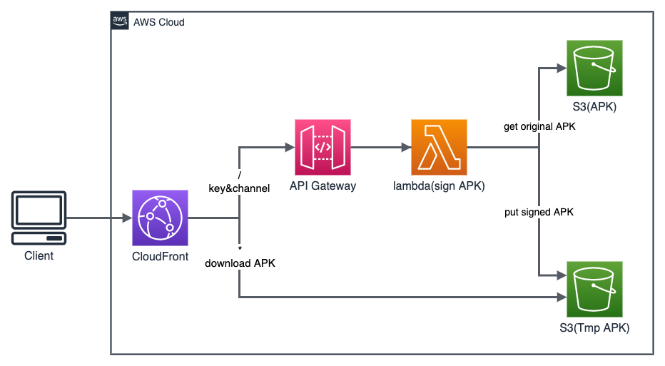

# APK Distribution

apk-distribution APK distribution allows developers to add download channel information to their Android app installation packages (APKs). This channel data can then be used for attribution and analytics purposes.



The Android client can access the URL with key and channel parameters to download the APK package with channel signature. The specific process is as follows:

1. CloudFront forwards the request to Amazon API Gateway. API Gateway calls the Lambda dynamic packaging function.  
2. Lambda first checks if the corresponding content already exists in the Amazon Simple Storage Service (S3) that temporarily stores the packaged APK. If it exists, it directly returns the corresponding download link address.
3. If the corresponding APK package does not exist, it finds the dynamic packaging mother package from the location where the original APK package is stored, processes it using the channel parameter in the URL, uploads it to the S3 that stores the packaged APK, and returns the corresponding download link address.
4. The Android client obtains the APK package with channel identification.

## API Definition

### dynamic packaging

#### Request

Method: GET

| Parameter | Required | Description |
| - | -| -|
|key|Yes |Key of the APK that needs to be dynamically packaged in the S3 bucket|
|channel|No|The name of the channel, if not provided, download the original APK directly|
|sign|No|Must be provided if the template parameter APPkey is not empty, the signature is md5(key+channel+APPkey)|

For example:
CloudFront domain name is d1234567890r.cloudfront.net, CName is cloudfront.example.com.

```linux
# Template parameter APPkey is empty
curl -I 'https://cloudfront.example.com/?key=ets.apk&channel=aws'

# Template parameter APPkey is not empty
curl -I 'https://cloudfront.example.com/?key=aws.apk&channel=aws&sign=e10adc3949ba59abbe56e057f20f883'
````

#### Response

HTTP 302 and corresponding redirect URL

For example：

```HTTP
HTTP/1.1 302 Found
Content-Length: 0
Connection: keep-alive
Date: Tue, 08 Nov 2022 16:41:05 GMT
location: /aws_aws.apk
Apigw-Requestid: bSn4whXZSQ0EJqg=
X-Cache: Miss from cloudfront
```

## Deploy Guide

Click the link [apk-distribution](https://console.aws.amazon.com/lambda/home#/create/app?applicationId=arn:aws:serverlessrepo:us-west-2:699461715380:applications/apk-distribution) to open the application page in the AWS Serverless Application Repository. Enter the name of the S3 bucket that stores the download packages, check the box to confirm that the application will create the corresponding resource policies, and click the Deploy button to install.

**Note:** The S3 bucket for storing the APK packages must already be created. The APPkey needs to be filled in if signing and validating access links.

After the installation is complete, you can select the corresponding stack in the CloudFormation console page, and check Outputs to see the corresponding CloudFront domain name.


In the browser, enter https://\<your-cloudfront-domain\>?key=test.apk&channel=aws to test the download.
**Note:** Replace \<your-cloudfront-domain\> with the CloudFront domain name you see, and the test.apk file needs to exist in the S3 bucket.

Run the following command to view the channel information in the APK package. Download walle-cli-all.jar from this [link](https://github.com/Meituan-Dianping/walle/releases/):

```linux
java -jar walle-cli-all.jar show test_aws.apk
```

## Referer

- walle <https://github.com/Meituan-Dianping/walle.git>
