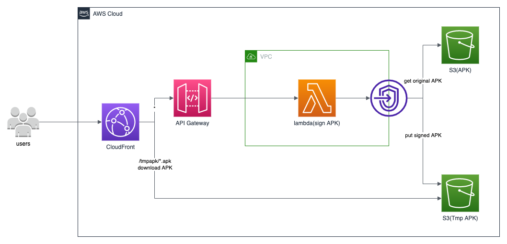

# APK Distribution (Java)



The project source includes function code and supporting resources:

- `src/main` - A Java function.
- `src/test` - A unit test and helper classes.
- `template.yml` - An AWS CloudFormation template that creates an application.
- `build.gradle` - A Gradle build file.
- `1-create-bucket.sh`, `2-build-layer.sh`, etc. - Shell scripts that use the AWS CLI to deploy and manage the application.

Use the following instructions to deploy the sample application.

## Requirements

- [Java 8 runtime environment (SE JRE)](https://www.oracle.com/java/technologies/javase-downloads.html)
- [Gradle 5](https://gradle.org/releases/) or [Maven 3](https://maven.apache.org/docs/history.html)
- The Bash shell. For Linux and macOS, this is included by default. In Windows 10, you can install the [Windows Subsystem for Linux](https://docs.microsoft.com/en-us/windows/wsl/install-win10) to get a Windows-integrated version of Ubuntu and Bash.
- [The AWS CLI](https://docs.aws.amazon.com/cli/latest/userguide/cli-chap-install.html) v1.17 or newer.

If you use the AWS CLI v2, add the following to your [configuration file](https://docs.aws.amazon.com/cli/latest/userguide/cli-configure-files.html) (`~/.aws/config`):

```linux
cli_binary_format=raw-in-base64-out
```

This setting enables the AWS CLI v2 to load JSON events from a file, matching the v1 behavior.

## Setup

Download or clone this repository.

```linux
git clone https://github.com/turmind/apk-distribution.git
```

To create a new bucket for deployment artifacts, run `1-create-bucket.sh`.

```linux
./1-create-bucket.sh
```

To build a Lambda layer that contains the function's runtime dependencies, run `2-build-layer.sh`. Packaging dependencies in a layer reduces the size of the deployment package that you upload when you modify your code.

```linux
./2-build-layer.sh
```

## Deploy

To deploy the application, run `3-deploy.sh`.

```linux
./3-deploy.sh
```

This script uses AWS CloudFormation to deploy the Lambda functions and an IAM role. If the AWS CloudFormation stack that contains the resources already exists, the script updates it with any changes to the template or function code.

## Cleanup

To delete the application, run `5-cleanup.sh`.

```linux
./5-cleanup.sh
```

## Referer

- walle <https://github.com/Meituan-Dianping/walle.git>
